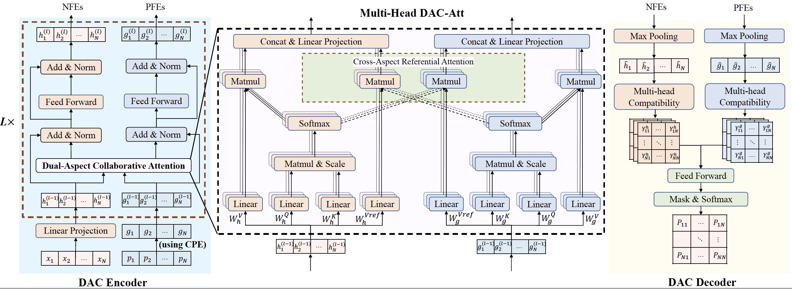

# VRP-DACT
DACT is a learning based improvement model for solving routing problems (e.g., TSP and CVRP), which explores dual-aspect representation, dual-aspect collaborative attention (DAC-Att) and cyclic positional encoding (CPE). It is trained by n-step Proximal Policy Optimization (PPO) with a curriculum learning (CL) strategy.


# Paper


This repo implements our paper: ["Learning to Iteratively Solve Routing Problems with Dual-Aspect Collaborative Transformer"](http://arxiv.org/abs/xxxx.xxxxx), which has been accepted at NeurIPS 2021. Please cite our paper if the code is useful for your project.
```
@inproceedings{Ma2021learning,
    author = {Yining Ma and Jingwen Li and Zhiguang Cao and Wen Song and Le Zhang and Zhenghua Chen and Jing Tang},
    booktitle = {Advances in Neural Information Processing Systems},
    title = {Learning to Iteratively Solve Routing Problems with Dual-Aspect Collaborative Transformer},
    volume = {34},
    year = {2021}
}
```


# Dependencies
* Python>=3.6
* PyTorch>=1.1
* numpy
* tensorboard_logger
* tqdm
* cv2
* matplotlib

### Note:
For the exception below from package tensorboard_logger,
```python
AttributeError: module 'scipy.misc' has no attribute 'toimage'
```
Please refer to [issue #27](https://github.com/TeamHG-Memex/tensorboard_logger/issues/27) to fix it.


# Usage
## Generating data
Training data is generated on the fly. Please follow repo [wouterkool/attention-learn-to-route](https://github.com/wouterkool/attention-learn-to-route) to generate validating or test data if needed. We also provide some randomly generated data in the  [datasets](./datasets) folder.

## Training
### TSP example
For training TSP instances with 50 nodes and GPU cards {0,1}:
```python
CUDA_VISIBLE_DEVICES=0,1 python run.py --problem tsp --graph_size 50 --step_method 2_opt --n_step 4 --T_train 200 --Xi_CL 2 --max_grad_norm 0.2 --val_m 1 --val_dataset  './datasets/tsp_50_10000.pkl' --run_name 'example_training_TSP50'
```

### CVRP example
For training CVRP instances with 20 nodes and GPU cards {0,1}:
```python
CUDA_VISIBLE_DEVICES=0,1 python run.py --problem vrp --graph_size 20 --dummy_rate 0.5 --step_method 2_opt --n_step 10 --T_train 500 --Xi_CL 1 --max_grad_norm 0.04 --val_m 1 --val_dataset  './datasets/cvrp_20_10000.pkl' --run_name 'example_training_CVRP20'
```

### Warm start
You can initialize a run using a pretrained model by adding the --load_path option:
```python
--load_path '{add model to load here}'
```
### Resume Traning
You can resume a training by adding the --resume option:
```python
--resume '{add last saved checkpoint(model) to resume here}'
```
The Tensorboard logs will be saved to folder "logs" and the trained model (checkpoint) will be saved to folder "outputs". Pretrained models are provided in the [pretrained](./pretrained) folders.

## Inference
Load the model and specify the iteration T for inference (using --val_m for data augments):

```python
--eval_only 
--load_path '{add model to load here}'
--T_max 10000 
--val_size 10000 
--val_dataset '{add dataset here}' 
--val_m 8
```

### Examples
For inference 10,000 TSP instances with 100 nodes and no data augment:
```python
CUDA_VISIBLE_DEVICES=0,1,2,3 python run.py --problem tsp --graph_size 100 --step_method 2_opt --eval_only --load_path 'pretrained/tsp100-epoch-195.pt' --T_max 10000 --val_size 10000 --val_dataset  './datasets/tsp_100_10000.pkl' --val_m 1 --no_saving --no_tb
```
For inference 512 CVRP instances with 100 nodes and 8 data augments:
```python
CUDA_VISIBLE_DEVICES=0,1,2,3 python run.py --problem vrp --graph_size 100 --dummy_rate 0.2 --step_method 2_opt --eval_only --load_path 'pretrained/cvrp100-epoch-193.pt' --T_max 10000 --val_size 512 --val_dataset  './datasets/cvrp_100_10000.pkl' --val_m 8 --no_saving --no_tb
```
See [options.py](./options.py) for detailed help on the meaning of each argument.

# Acknowledgements
The code and the framework are based on the repos [wouterkool/attention-learn-to-route](https://github.com/wouterkool/attention-learn-to-route) and [yining043/TSP-improve](https://github.com/yining043/TSP-improve).
